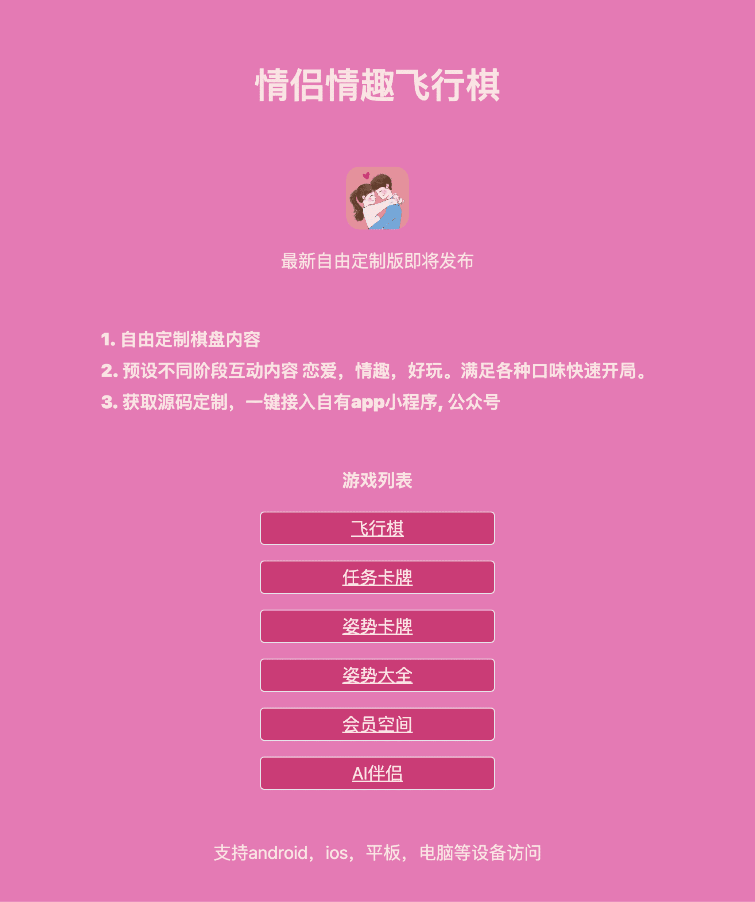

## 情侣飞行棋 && 姿势卡牌



## 访问地址 https://17fei.fun

### 这是一个情侣互动小游戏网站。会员现为免费服务端注册，不包含任何支付或人工收款流程。

### 部署运行

本地需安装 [Deno](https://docs.deno.com/runtime/getting_started/installation/)。PowerShell 可执行：

```powershell
irm https://deno.land/install.ps1 | iex
```

重新打开终端后进入本目录，执行：

开发命令

```
deno task start
```

如果终端提示找不到 `deno`，在 Windows 资源管理器中右键点击 `start.ps1`，选择“使用 PowerShell 运行”；或在本目录执行：

```powershell
powershell -ExecutionPolicy Bypass -File .\start.ps1
```

访问 `http://localhost:8000`。首次启动会下载 Fresh/Preact 依赖；会员会话和订阅登记保存在本机 Deno KV 数据库中。

生产预览使用 `deno task build` 后执行 `deno task preview`。

### 内容资源说明

原项目引用的 `static/positions/` 图片并未包含在仓库，且被 `.gitignore` 排除。为使克隆后的项目可直接运行，姿势页和随机卡牌已改为文字卡牌，不再请求缺失图片。若拥有合规、已获授权的图片素材，可自行恢复图片渲染并将资源放入该目录。

### 技术架构

虽然是纯前端项目， 但是使用了fresh + deno的技术栈。 相对小众但是和next.js有相似的地方，半小时左右可上手。

### 其他分享

https://17fei.fun/share0
